# Faster-FISTA

Matlab code to reproduce the results of the paper

Faster FISTA

Jingwei Liang, Carola-Bibiane Schönlieb, Preprint 2018

## Quadratic problem

Consider solving the problem below
$$
\min_{x\in \mathbb{R}^n} ~ \frac{1}{2} \|Ax - f\|^2  ,
$$
where $A$ is the Laplacian operator
$$
A = 
\begin{bmatrix}
2 & -1 & & & & & &  \\
-1 & 2 & -1 & & & & &  \\
 & -1 & 2 & -1 & & & &  \\
 & & & \dotsm \\
 &  & & & -1 & 2 & -1 &  \\
 & &  & & & -1 & 2 & -1  \\
 & & &  & & & -1 & 2  \\
\end{bmatrix} .
$$

We set $n = 201$.

 Relative error $\|x_{k}-x_{k-1}\|$          |  Objective function value $\Phi(x_{k}) - \Phi(x^\star)$
:-------------------------:|:-------------------------:
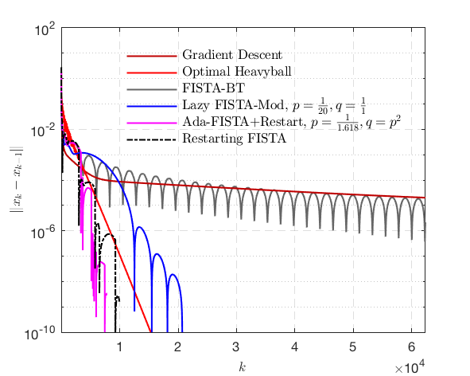  |  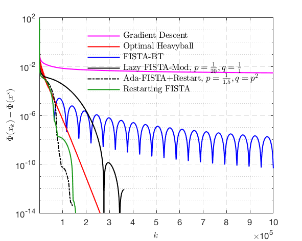

## Linear inverse problems

Consider solving the problem below
$$
\min_{x\in \mathbb{R}^n} ~ \mu R(x) + \frac{1}{2} \|Ax - f\|^2  .
$$

#### $\ell_{1}$-norm
 Relative error $\|x_{k}-x_{k-1}\|$          |  Objective function value $\Phi(x_{k}) - \Phi(x^\star)$
:-------------------------:|:-------------------------:
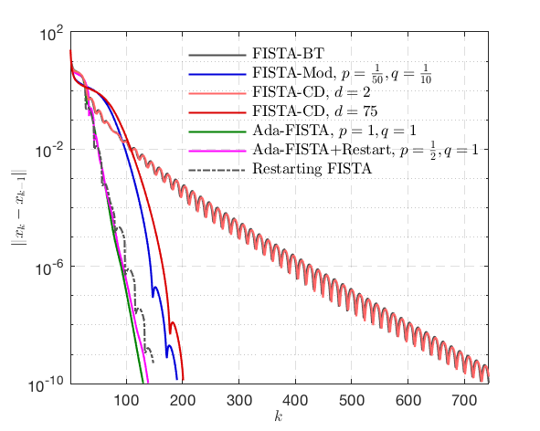  |  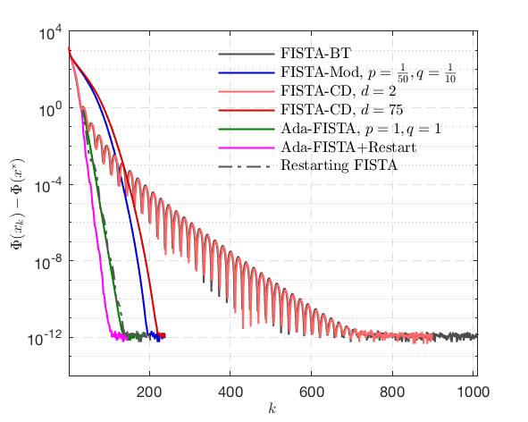

#### $\ell_{1,2}$-norm
 Relative error $\|x_{k}-x_{k-1}\|$          |  Objective function value $\Phi(x_{k}) - \Phi(x^\star)$
:-------------------------:|:-------------------------:
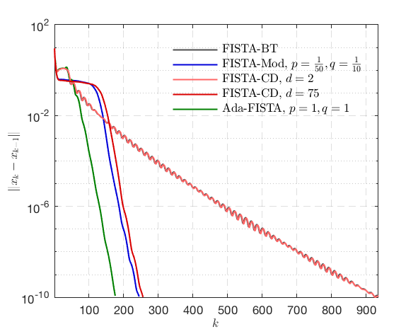  |  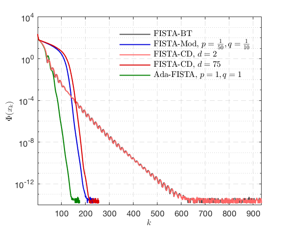

#### $\ell_{\infty}$-norm
 Relative error $\|x_{k}-x_{k-1}\|$          |  Objective function value $\Phi(x_{k}) - \Phi(x^\star)$
:-------------------------:|:-------------------------:
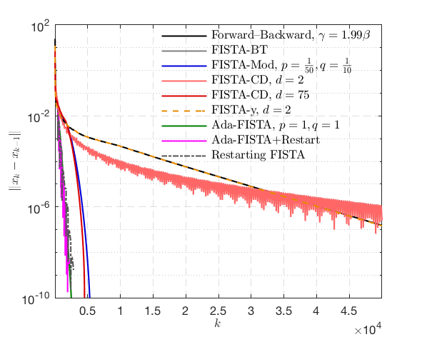  |  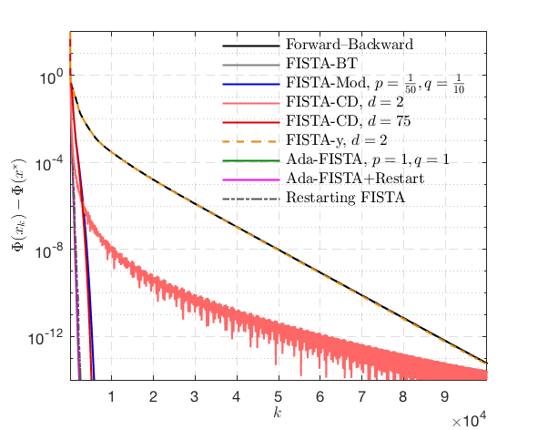

## Total variation based image deblur

##### The codes only run under MacOS

 Original image    |   Blurred image  |   Recovered image          |  Performance comparison
:-------------------------:|:-------------------------:|:-------------------------:|:-------------------------:
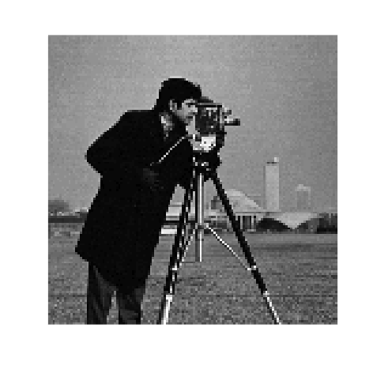  |    |  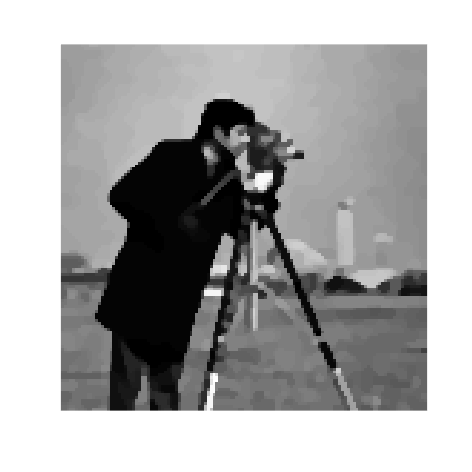  |  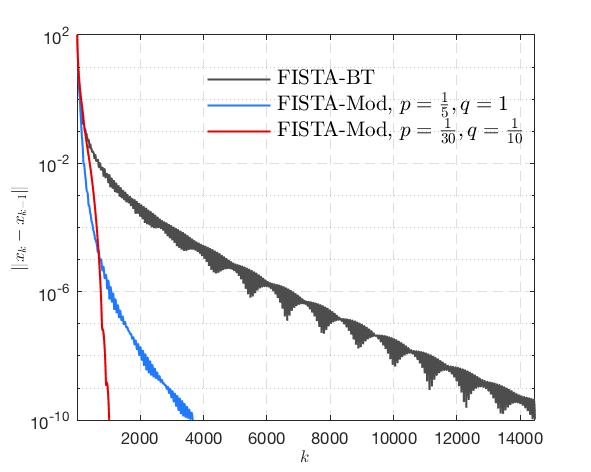

## Principle component pursuit

#### Matrix example

 Mixture matrix    |   Sparse component  |   Low-rank component          |  Performance comparison
:-------------------------:|:-------------------------:|:-------------------------:|:-------------------------:
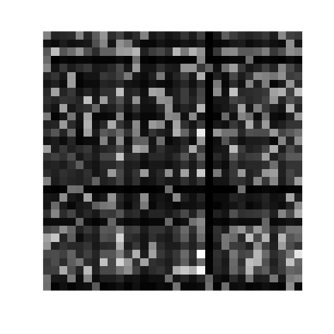  |  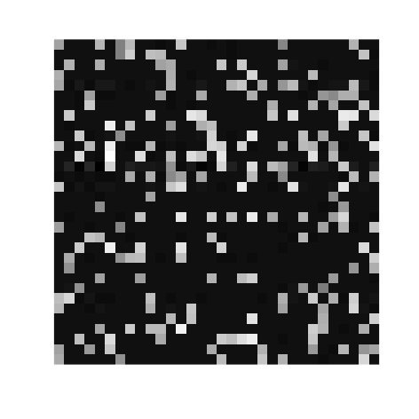  |  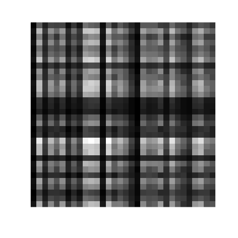  |  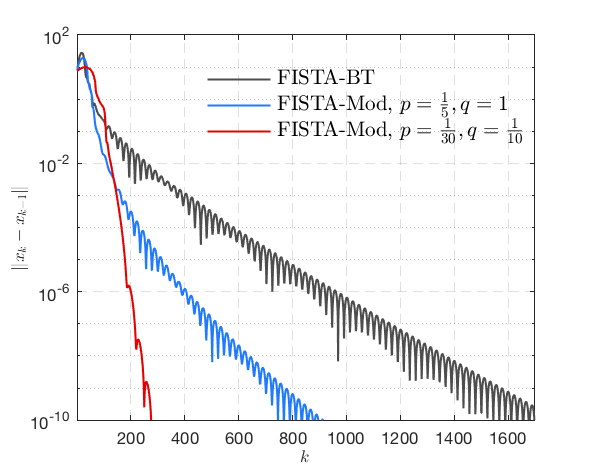

#### Video example

 Original frame    |   Foreground  |   Background          |  Performance comparison
:-------------------------:|:-------------------------:|:-------------------------:|:-------------------------:
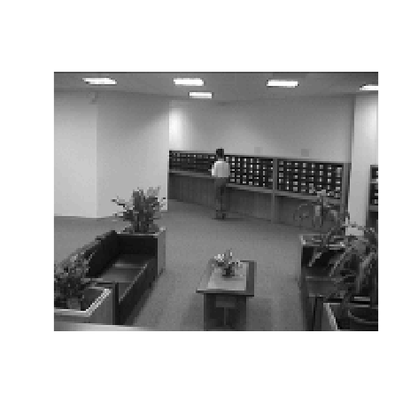  |    |    |  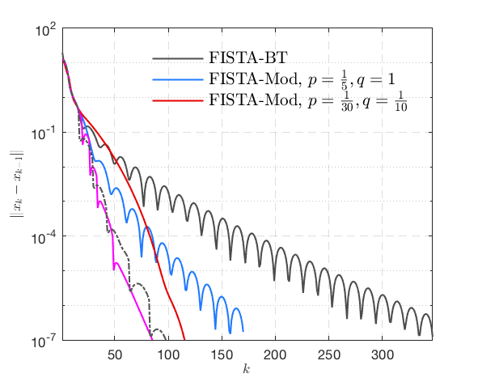

Copyright (c) 2018 Jingwei Liang