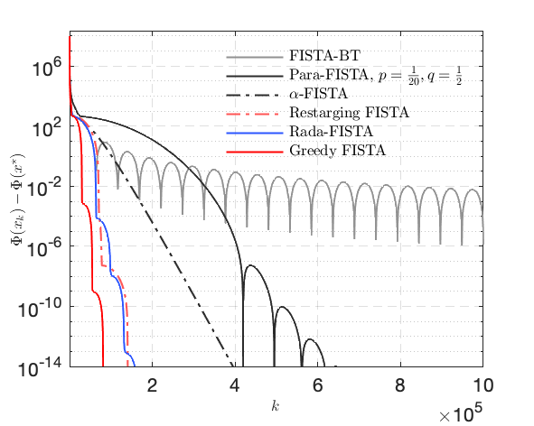
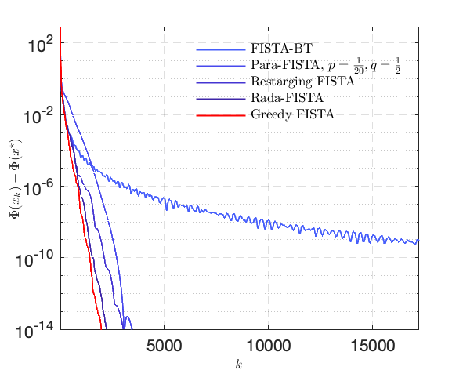
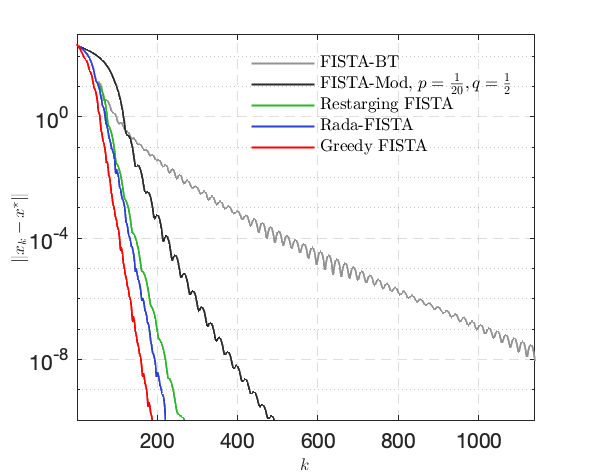
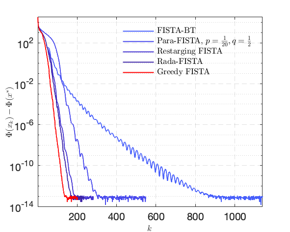

# Faster-FISTA

Matlab code to reproduce the results of the paper

[Improving FISTA: Faster, Smarter and Greedier](https://jliang993.github.io/resources/journal/faster-fista.pdf)

[Jingwei Liang](https://jliang993.github.io/), [Carola-Bibiane Schönlieb](http://www.damtp.cam.ac.uk/user/cbs31/Home.html), 2018

## Quadratic problem

Consider solving the problem below
$$
\min_{x\in \mathbb{R}^n} ~ \frac{1}{2} \|Ax - f\|^2  ,
$$
where $A$ is the Laplacian operator
$$
A = 
\begin{bmatrix}
2 & -1 & & &    \\
-1 & 2 & -1 & &   \\
%& -1 & 2 & -1 & &  &  \\
&  & \dotsm & & \\
%&  &  & -1 & 2 & -1 &  \\
& & -1 & 2 & -1  \\
& & & -1 & 2  \\
\end{bmatrix}_{n}   .
$$

We set $n = 201$.

 Error $\|x_{k}-x^\star\|$          |  Objective function $\Phi(x_{k}) - \Phi(x^\star)$
:-------------------------:|:-------------------------:
  |  

## Linear inverse problems

Consider solving the problem below
$$
\min_{x\in \mathbb{R}^n} ~ \mu R(x) + \frac{1}{2} \|Ax - f\|^2  .
$$

#### $\ell_{1}$-norm
 Error $\|x_{k}-x^\star\|$          |  Objective function $\Phi(x_{k}) - \Phi(x^\star)$
:-------------------------:|:-------------------------:
  |  

#### $\ell_{1,2}$-norm
 Error $\|x_{k}-x^\star\|$          |  Objective function $\Phi(x_{k}) - \Phi(x^\star)$
:-------------------------:|:-------------------------:
  |  

#### $\ell_{\infty}$-norm
 Error $\|x_{k}-x^\star\|$          |  Objective function $\Phi(x_{k}) - \Phi(x^\star)$
:-------------------------:|:-------------------------:
  |  

#### Total variation
 Error $\|x_{k}-x^\star\|$          |  Objective function $\Phi(x_{k}) - \Phi(x^\star)$
:-------------------------:|:-------------------------:
  |  

## Sparse logistic regression

Consider the problem
$$
\min_{x \in \mathbb{R}^n }  \mu \|x\|_{1} + \frac{1}{m} \sum_{i=1}^m \log({ 1+e^{ -l_{i} h_{i}^T x } })  ,
$$

 Error $\|x_{k}-x^\star\|$          |  Objective function $\Phi(x_{k}) - \Phi(x^\star)$
:-------------------------:|:-------------------------:
  |  

## Principle component pursuit

PCP considers the following problem
$$
\min_{x_{l}, x_{s} \in \mathbb{R}^{m\times n}}~ \frac{1}{2}\|f-x_{l}-x_{s}\|^2 + \mu \|x_{s}\|_1 + \nu \|x_{l}\|_*  .
$$

 Original frame    |   Foreground  |   Background          |  Performance comparison
:-------------------------:|:-------------------------:|:-------------------------:|:-------------------------:
  |    |    |  

Copyright (c) 2018 Jingwei Liang